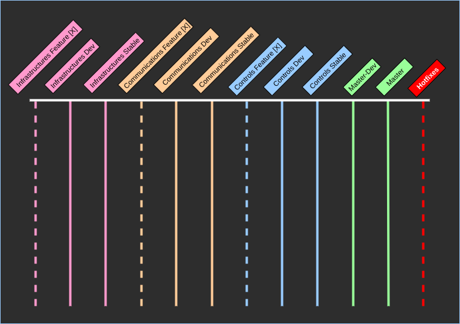

# University of Toronto Hyperloop Team Software Core #

## Directory Structure ##

## Overview ##


### The Three Teams ###
***Control Systems***
- Control systems is responsible for the high-level autonomy of the pod
  - Informed decision making from sensors and state estimators
  - Fined-grained control over active components such as the drive and braking systems

***Communications System***
- The communications system is responsible for the internal and external communications on the pod
  - Relaying control signals
  - Relaying data from sensors
- Communications also is responsible for health monitoring (sensor value ranges & data transmission rates) as well as establishing reliable connections to our control panel and to SpaceX

***Infrastructures***
- Infrastructures develops the real-time control panel as well as pod simulator
- The simulator allows us to run our pod through virtual scenarios and evaluate our pod by analyzing performance and identifying potential issues, for example
  - The simulator is also able to accept real-time manual input to allow testing from SpaceX or any other member who wishes to see the behavious of our pod given certain inputs say
- Infrastructures also plays a role in QA

## Git & Development Workflow ##

## Before you start... ##
- Files more than a few MB in size should not pushed to the repo unless there is a good reason
- **Always** check what files you're about to commit before doing so. `git status`
- No binaries or automatically generated files should ever be committed. (Unless there is a very very very good reason)

## GIT Workflow ##
USE THE CLI!!

The GIT workflow used here is not novel, it pulls a lot from ideas found here...
[Here](https://blog.logrocket.com/the-git-workflow-you-need-how-to-deal-with-multiple-teams-in-a-single-repository-faf5bb17a6e4/)
, [and here](https://nvie.com/posts/a-successful-git-branching-model/)

To start off, here is what the branching schema looks like. (This would represent, at a high level, a start/end to a sprint)


The basic idea...
- A dotted line represents temporary branches, solid lines are "permanent"
- Each team has a `dev`, `stable`, and multiple `feature` branches
- Branches...
  - Master
    - At any given moment, the most recent `tag` represents pod-ready software
  - Hotfix
    - Resolve issues unforeseen on the stable `master` branch
- During the start of every sprint, all teams pull from their latest stable tag
  - Any branch created within this sprint must pull from this stable tag
  - All work (features) during the sprint gets merged to the \*-dev branch
  - Upon completion of the sprint, all new features are tested and confirmed as stable and merged to \*-stable
  - Subsequently, each team's stables are merged to `master-dev` for further QA and final merging to `master`
- Reference the links from above for more details...

### Branch Naming Conventions ###
- Every team has a `\*-stable` and `\*-dev` branch
- `feature` branches are to named as follows:
  - `infrastructures-(unique feature name)`
  - `communications-(unique feature name)`
  - `controls-(unique feature name)`
  - The decision of (unique feature name) is up to you, but keep it short and informative

### Commit Message Formats ###
[Reference](https://chris.beams.io/posts/git-commit/)
The seven rules to follow...
1. Separate subject from body with a blank line
2. Limit the subject line to 50 characters
3. Capitalize the subject line
4. Do not end the subject line with a period
5. Use the imperative mood in the subject line
6. Wrap the body at 72 characters
7. Use the body to explain what and why vs. how

For details on each step, follow the link referenced above. I won't repeat.

### Commands to use when working ###

### GIT Practice Instructions ###
**Note that this is purely introductory. Some concepts like `git rebasing` and maybe even `pull requests` will come later**
- First is to read this entire README and follow any and all instalation instructions
- The code we will working with can be found a `software/git-practice`. For those who thought this was going to be a really complex practice, it's not, so I apologize ahead of time. This will be a **very** basic introduction
- Now is where we need to follow the guidelines setup for this workflow.
  - Each team has a `\*-dev` and `\*-stable` branch, which is currently all the same as master. For the purposes of this practice, you can directly create a new `feature` branch from your team's stable branch. In the future however, at the start of each sprint, you would create the branch from the `\*-dev` branch which would start off as a "clone" of the latest tag on your team's branch. If none of this makes sense to you, I suggest maybe reading on how the tutorials I mentioned and on concepts such as `git tagging` and what not. You can also reach out to me and ask.
    - The command you effectively issue then is as follows: Note, replace \*\*feature\*\* with your feature name. In this case, just use like your own name or something like `practice-Mat`
    - `git checkout -b infrastructures-**feature** infrastructures-stable`
    - `git checkout -b communications-**feature** communications-stable`
    - `git checkout -b controls-**feature** controls-stable`
  - Now the "feature" you are developping is really to just go into `send_and_receive.py` and edit the lines 21-22. Basically, just change the values of the LCM message and publish them. The key here is that you are all going to be editing the same lines, so once you're done, commit your changes and merge them to `\*-dev` -> your team's respective dev branch. You will run into merge conflicts, and make sure that you resolve them!! Don't overwrite other peoples' code, make sure the resulting file includes your lines and theirs!. At the end, I should be able to merge all the `\*-dev` branches and run the code to print everyone's messages.
    - `git add send_and_receive.py` -> stage your changes for commit
    - `git status` -> always good practice to check what is staged and isn't before commiting to make sure you aren't doing anything wrong
    - `git commit` or `git commit -m ""` (if you just have a quick message. But be careful of message length!)
    - `git push origin team-name-feature-name` -> here, `team-name-feature-name` is the name of the feature branch you are currently working on, not the dev branch or the stable branch!
    - now merge your changes with `\*-dev`...
    - `git checkout \*-dev` -> checkout your team's dev branch
    - `git merge team-name-feature-name` -> This "will" cause merge conflicts (if you are the first one making changes, then maybe not)
    - to resolve merge conflicts, there are many ways. I won't describe them all, and leave it to you to research online. (However, I use `git mergetool`, and I've defined in the `~/.gitconfig` to use my `vim` editor to resolve merge conflicts)
    - once you've merged, make sure everything is okay -> as in, your changes, + any changes that were there are not overwritten
    - `git push origin \*-dev` push changes to your team's dev branch
  - And that's it! As it stands, only select people are allowd to merge `\*-dev` and `\*-stable` branches, so once you merge to `\*-dev`, that's everything
  - You can now also delete your feature branch
    - 'git branch -d team-name-feature-name` -> whatever your feature branch name was
    - 'git push -d origin team-name-feature-name` -> whatever your feature branch name was

## Installation guide ##

The first thing is to init and update all submodules. Running `git submodule update --init --recursive` will accomplish this.

### Installing LCM ###
To ensure LCM is setup properly, I suggest reading our [lcm-practice repo](https://github.com/utht/lcm-practice) and the [official lcm build instructions](https://lcm-proj.github.io/build_instructions.html) for more information.

#### This is for linux (I run Arch, it should work on Ubuntu/Debian also. For Mac, windows, or others, check the documentation [here](https://github.com/lcm-proj/lcm/blob/master/docs/content/build-instructions.md)

Before getting started, make sure the LCM repository (Found in this repository at path `software/lcm` is checked out to `v1.4.0` (it should already be)
To check this, run `git branch` -> you should see something like `(HEAD detached at v1.4.0)`
If not, run `git checkout v1.4.0`

The following packages are required:
- build-essential
- libglib2.0-dev

The following packages are strongly recommended:
- default-jdk (or openjdk-9-jdk)
- python-dev

Run the following commands

```
cd lcm
mkdir build
cd build
cmake ..
make
sudo make install
```
Finally, run the following ... (This is for Arch, I am not 100% sure you need to do this for Arch/Debian. Check the [link](https://github.com/lcm-proj/lcm/blob/master/docs/content/build-instructions.md))
```
export LCM_INSTALL_DIR=/usr/local/lib
sudo echo 'sudo echo $LCM_INSTALL_DIR > /etc/ld.so.conf.d/lcm.conf
export PYTHON_VERSION=$(python -c "import sys; print(\"%s.%s\" % sys.version_info[:2])")
export PYTHON_USER_SITE=$(python -m site --user-site)
sudo echo "$LCM_INSTALL_DIR/python$PYTHON_VERSION/site-packages" > /usr/lib/python$PYTHON_VERSION/site-packages/lcm.pth
```

* note, I use `pyenv` to control python versions on my system, so I also added the `site-packages` location for my `python 3.7.3` installation to `/usr/lib/python$PYTHON_VERSION/site-packages/lcm  .pth`

Additionally, you may need to configure pkgconfig to find lcm.pc
`export PKG_CONFIG_PATH=$PKG_CONFIG_PATH:$LCM_LIBRARY_DIR/pkgconfig`

**To check everything works**
Go to `software/git-practice` and type `lcm-gen -p test_message.lcm`
If no errors appear, and this generates a `test_message.py` file, then everything "should" work.

### Dependencies ###
- LCM  (Lightweight Communications Marshalling)
  - To install LCM, follow the instructions here... [instructions to build LCM](https://lcm-proj.github.io/build_instructions.html)

## Notes on Using LCM ##
Firstly, this description is redundant information pulled from the [official documentation](https://lcm-proj.github.io/). But, frequent occurences to note.

To generate the language-specific bindings...

| Language | Command |
| -------- | --------  |
| C	| `lcm-gen -c example_t.lcm` |
| C++	| `lcm-gen -x example_t.lcm` |
| Python	| `lcm-gen -p example_t.lcm` |

### Example Code ###
Example code can be found under `software/core/example`. To run it, first type `make` to build the exec. files. `cd` into the build folder, and run `./listen`. Either send that process to the background `ctrl-z` then `bg` or open a new terminal and run the `./send`.
