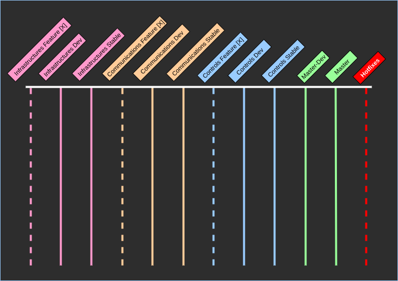

# University of Toronto Software Core #

## Overview ##

## Git & Development Workflow ##

## Before you start... ##
- Files more than a few MB in size should not pushed to the repo unless there is a good reason
- **Always** check what files you're about to commit before doing so. `git status`
- No binaries or automatically generated files should ever be committed. (Unless there is a very very very good reason)

## GIT Workflow ##
The GIT workflow used here is not novel, it pulls a lot from ideas found here...
[Here](https://blog.logrocket.com/the-git-workflow-you-need-how-to-deal-with-multiple-teams-in-a-single-repository-faf5bb17a6e4/)
[And here](https://nvie.com/posts/a-successful-git-branching-model/)

To start off, here is what the branching schema looks like.

### What it means... ###

### per stage commands... ###

## Installation guide ##

### Dependencies ###

