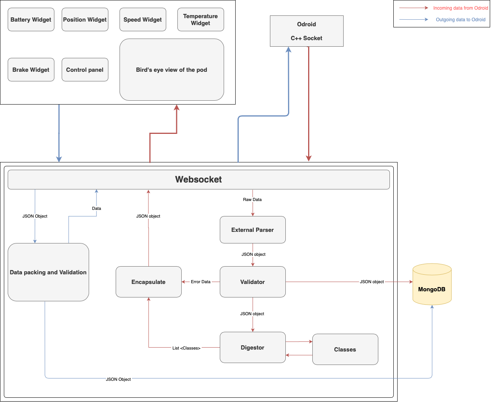

# Infrastructure 

### Table of Contents
1. [Architecture](#Overview)
2. [Module Breakdown](#application-breakdown)
3. [Installation Guide](#installation-guide)

<hr>

## Architecture 
The Infrastructure carries out data transmission from the Odroid (master computer in the pod) to the central system (backend) in the laptop. The central system is an intricate and comprehensive data parsing, validating, encapsulating, and storing mechanism that acts as the backbone of the entire subsystem. The validated data is sent to the widgets (frontend) to be analyzed by the user to detect any errors which are further relayed to other subsystems (for example energy, electronics, propulsion etc.). Beginning from the user’s first interaction with pod data, the widgets depict various graphs and charts that display sensor readings. A Birds-eye view module is integrated to easily locate sensors with abnormal readings whose unique ID can be relayed to the appropriate subteam to initiate debugging. The above explanation is concisely depicted in the Software Architecture Diagram 



## Module Breakdown
_Details coming soon_


## Installation Guide

There are two parts for installation. You have to install npm libraries independently for frontend and backend. 

For backend:

``` sh
cd backend
npm i           #install npm modules
npm start       #start nodejs server
```

For frontend:
```sh
cd AngularFrontend
npm i           #install npm modules
npm start       #start react server at port 4200
```

Now you can open multiple instances in the browser at `localhost:4200/` and each instance will be connected to the WebSocket.

#### Compiling C++ socket
We can succesfully connect to Nodejs Websocket with C++ websocket. You can compile and run C++ as follows:

```sh
make
./socket
```

In some cases, make file will throw error due to SSL (can be reproduced in MacOS Big Sur). In that case, you can run the following to compile:

```sh
g++ -std=c++11 socket.cpp -I$(brew --prefix openssl)/include -I$(brew --prefix cpprestsdk)/include -L$(brew --prefix openssl)/lib -L$(brew --prefix cpprestsdk)/lib -I$(brew --prefix boost)/include -L$(brew --prefix boost)/lib -lcpprest -lcrypto -lssl -lboost_system -lboost_chrono -lboost_thread-mt

./a.out
```

<b style="color:red"> NOTE: make sure you have nodejs running before running ./a.out</b>

#### Creating Component for Angular
If you want to create an independent component in Angular, make sure you create it inside components folder. You can use the following command:

`ng generate component components/<nameOfPackage>`

#### 

<!-- #### Test for websocket connection:
Test for websocket should be divided into  -->


<!-- ## Infrastructure - Sprint 1

As of right now, the nodejs is being used as the backend, and React is used for the front-end (for fast deployment purpose). For future development, We will be shifting to Angular.

This skeleton code can be used to complete ticket _" Implementing types in Web socket for data routes"_. -->